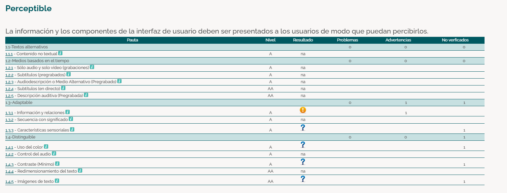
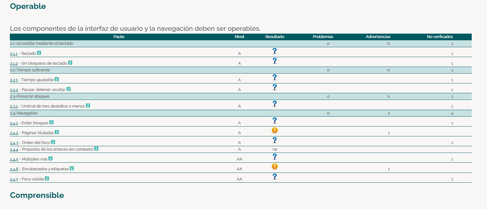
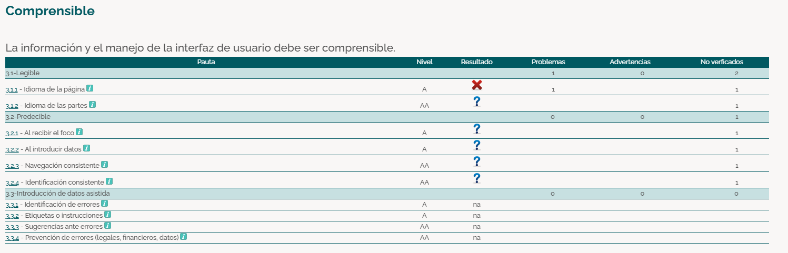
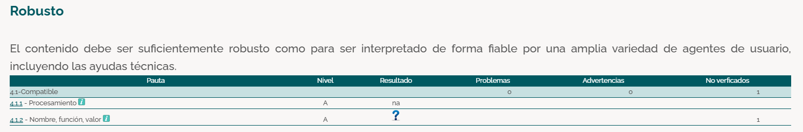

# Fase 1: Reconocimiento de la necesidad de accesibilidad web

### 1. Investigar sobre la accesibilidad web.

- ¿Por qué es importante diseñar webs accesibles?

    Es esencial para garantizar que todas las personas, independientemente de sus capacidades o limitaciones, puedan acceder y utilizar la información y los servicios en línea. Esto incluye a personas con discapacidades visuales, auditivas, motoras, etc. Al diseñar estos sitios web, se promueve la inclusión digital y se asegura que nadie quede excluido del entorno digital.

- ¿Qué beneficios aporta a los usuarios (especialmente aquellos con discapacidades) y a los desarrolladores?

    - *Beneficios para usuarios y desarrolladores:*
    
        **Acceso equitativo:** Posibilita que todos los usuarios interactúen con el contenido web sin barreras.
        
        **Mejora la experiencia de usuario:** Un diseño accesible facilita la navegación y compresión de la información, lo que beneficia a todos los usuarios, no solo a aquellos con discapacidades.

        **Ampliación de la audiencia:** Al hacer el sitio web accesible, se llega a un público más amplio, incluyendo a personas con diversas discapacidades.

        **Mejora del posicionamiento en buscadores (SEO):** Muchas prácticas de accesibilidad, como el uso adecuado de etiquetas y descripciones, contribuyen a un mejor rendimiento en motores de búsqueda.

- Relación con normativas vigentes, como las WCAG 2.1 y el Real Decreto 1112/2018.

    Las Pautas de Accesibilidad al Contenido en la Web (WCAG) 2.1, desarrolladas por la Iniciativa de Accesibilidad Web (WAI) del W3C, establecen recomendaciones para mejorar la accesibilidad web. Se basan en cuatro principios fundamentales: perceptible, operable, comprensible y robusto.

    En España, el Real Decreto 1112/2018, que transpone la Directiva (UE) 2016/2102, obliga a los sitios web y aplicaciones móviles del sector público a cumplir con las WCAG 2.1 en sus niveles A y AA. Su objetivo es garantizar la accesibilidad para todos los ciudadanos, con especial atención a personas con discapacidades y mayores.

### 2. Reflexionar sobre cómo la accesibilidad mejora la experiencia del usuario (UX) y contribuye a la inclusión digital.

La accesibilidad web mejora la experiencia del usuario al ofrecer una interacción intuitiva, navegación sencilla y contenido claro. Beneficia tanto a personas con discapacidades como al público en general, mejorando la usabilidad.

Además, es clave para la inclusión digital, garantizando igualdad de acceso a la información y servicios en una sociedad cada vez más digitalizada.

En definitiva, diseñar sitios accesibles fomenta la inclusión, cumple con normativas y mejora la experiencia de todos los usuarios.

# Fase 2: Análisis inicial de accesibilidad en documentos web
### 1. Seleccionar una página web para analizar.
https://gatesnfences.com/
### 2. Documentar los problemas.

## Informe de Evaluación de Accesibilidad - Principio "Perceptible"

## Descripción General
Este informe documenta la evaluación de accesibilidad basada en el principio de **Perceptibilidad** de las **WCAG 2.1**. Este principio establece que la información y los componentes de la interfaz de usuario deben ser presentados de manera que los usuarios puedan percibirlos.

Se analizan varias pautas dentro de este principio, incluyendo **textos alternativos, medios basados en el tiempo, adaptabilidad y distinguibilidad**.

## 1. Problemas Detectados

| **Tipo de problema** | **Ubicación (Pauta WCAG 2.1)** | **Impacto en la experiencia del usuario** |
|----------------------|--------------------------------|-------------------------------------------|
| **Falta de información estructurada** | 1.3.1 (Información y relaciones) | Puede dificultar la comprensión de la estructura de la página a usuarios con discapacidad cognitiva o que usan lectores de pantalla. |
| **Elementos no verificados (posibles problemas no evaluados)** | 1.3.3, 1.4.1, 1.4.3, 1.4.5 | Pueden existir errores ocultos en el contraste, uso del color y manejo de imágenes de texto, lo que afectaría la accesibilidad visual. |
| **Advertencia en estructuración de información** | 1.3.1 | Puede causar confusión en la interpretación del contenido. |

## 2. Análisis Detallado por Pautas

### 1. Textos Alternativos (1.1.1)
   - **Estado:** No Aplicable (na)  
   - **Impacto:** No se han identificado problemas, pero es importante garantizar que todas las imágenes y elementos gráficos tengan descripciones adecuadas.  

### 2. Medios Basados en el Tiempo (1.2)
   - Incluye subtítulos, audiodescripción y otros medios alternativos para contenido multimedia.  
   - **Estado:** No Aplicable (na)  
   - **Impacto:** No se evaluó en este análisis, pero si el sitio incluye videos, debe asegurarse de que haya subtítulos y audiodescripción.  

### 3. Adaptable (1.3)
   - **Problema detectado en 1.3.1 (Información y relaciones)**  
   - **Impacto:** Puede dificultar la interpretación de la información, especialmente para usuarios con lectores de pantalla.  

### 4. Distinguible (1.4)
   - **Contraste (1.4.3) y uso del color (1.4.1): No verificados**  
   - **Impacto:** Puede afectar a usuarios con baja visión o daltonismo.  

## 3. Recomendaciones

1. **Verificar el contraste mínimo (1.4.3)** para garantizar que el contenido sea legible para personas con baja visión.
2. **Mejorar la estructuración del contenido (1.3.1)** para facilitar la navegación con tecnologías asistivas.
3. **Asegurar que las imágenes de texto (1.4.5) tengan alternativas accesibles** o se utilicen métodos más accesibles para transmitir la información.
4. **Evaluar los elementos no verificados** para identificar problemas ocultos y corregirlos.

## Conclusión
El informe indica la necesidad de una revisión más profunda en la estructuración de la información y la presentación visual. La accesibilidad visual es clave para una experiencia inclusiva, por lo que se recomienda mejorar el contraste, la semántica del contenido y la navegación mediante tecnologías asistivas.

---

## Descripción General
Este informe documenta la evaluación de accesibilidad basada en el principio de **Operabilidad** de las **WCAG 2.1**. Este principio establece que los componentes de la interfaz de usuario y la navegación deben ser operables para todos los usuarios, incluyendo aquellos con discapacidades.

Se analizan diversas pautas dentro de este principio, incluyendo accesibilidad mediante teclado, tiempo suficiente para interactuar con el contenido, prevención de ataques epilépticos y navegabilidad.

## 1. Problemas Detectados

| **Pauta WCAG 2.1** | **Nivel** | **Resultado** | **Problemas** | **Advertencias** | **No verificados** |
|--------------------|-----------|---------------|---------------|------------------|------------------|
| 2.1.1 - Teclado | A | ? | 0 | 0 | 1 |
| 2.1.2 - Sin bloqueos de teclado | A | ? | 0 | 0 | 1 |
| 2.2.1 - Tiempo ajustable | A | ? | 0 | 0 | 1 |
| 2.2.2 - Pausar, detener, ocultar | A | ? | 0 | 0 | 1 |
| 2.3.1 - Umbral de tres destellos o menos | A | ? | 0 | 0 | 1 |
| 2.4.1 - Evitar bloqueos | A | ? | 0 | 2 | 4 |
| 2.4.2 - Páginas tituladas | A | ! | 0 | 1 | 1 |
| 2.4.3 - Orden del foco | A | ? | 0 | 0 | 1 |
| 2.4.4 - Propósito de los enlaces (en contexto) | A | na | 0 | 0 | 1 |
| 2.4.5 - Múltiples vías | AA | ! | 0 | 1 | 1 |
| 2.4.6 - Encabezados y etiquetas | AA | ? | 0 | 0 | 1 |
| 2.4.7 - Foco visible | AA | ? | 0 | 0 | 1 |

## 2. Análisis Detallado por Pautas

### 1. Accesible mediante teclado (2.1)
- **2.1.1 - Teclado:** Se requiere que todas las funcionalidades sean accesibles mediante teclado sin necesidad de un ratón.
- **2.1.2 - Sin bloqueos de teclado:** Asegura que el contenido no bloquee el uso del teclado.

### 2. Tiempo suficiente (2.2)
- **2.2.1 - Tiempo ajustable:** Los usuarios deben tener suficiente tiempo para leer y usar el contenido.
- **2.2.2 - Pausar, detener, ocultar:** Debe permitirse pausar o detener contenido en movimiento.

### 3. Provocar ataques (2.3)
- **2.3.1 - Umbral de tres destellos o menos:** Evita que contenido parpadeante cause ataques epilépticos.

### 4. Navegable (2.4)
- **2.4.1 - Evitar bloqueos:** Evita que los usuarios queden atrapados en elementos de la interfaz sin una forma de salir.
- **2.4.2 - Páginas tituladas:** Cada página debe tener un título descriptivo.
- **2.4.3 - Orden del foco:** Asegura que el foco del teclado se mueva de manera predecible.
- **2.4.4 - Propósito de los enlaces:** Los enlaces deben ser comprensibles dentro de su contexto.
- **2.4.5 - Múltiples vías:** Permite encontrar contenido a través de varios métodos.
- **2.4.6 - Encabezados y etiquetas:** Facilita la navegación y comprensión del contenido.
- **2.4.7 - Foco visible:** Destaca elementos interactivos cuando se usa teclado.

## 3. Recomendaciones
1. **Verificar y corregir los elementos no verificados** para garantizar conformidad con las WCAG 2.1.
2. **Mejorar la navegabilidad** asegurando que los títulos de página sean descriptivos y el foco del teclado sea predecible.
3. **Revisar advertencias en 2.4.1 y 2.4.5** para evitar bloqueos en la navegación.
4. **Asegurar accesibilidad total mediante teclado** en todas las funcionalidades.
5. **Evitar contenido parpadeante** que pueda provocar ataques epilépticos.

## 4. Conclusión
El análisis revela que varias pautas de accesibilidad requieren verificación adicional. Se recomienda una revisión completa del sitio web para garantizar conformidad con el principio de **Operabilidad** de las WCAG 2.1. Aplicar las mejoras sugeridas optimizará la experiencia del usuario y garantizará una accesibilidad adecuada.

---

## Descripción General
Este informe documenta la evaluación de accesibilidad basada en el principio de **Comprensibilidad** de las **WCAG 2.1**. Este principio establece que la información y el manejo de la interfaz de usuario deben ser comprensibles para todos los usuarios.

Se analizan diversas pautas dentro de este principio, incluyendo **legibilidad, previsibilidad e introducción de datos asistida**.

## 1. Problemas Detectados

| **Tipo de problema** | **Ubicación (Pauta WCAG 2.1)** | **Impacto en la experiencia del usuario** |
|----------------------|--------------------------------|-------------------------------------------|
| **Falta de especificación del idioma de la página** | 3.1.1 (Idioma de la página) | Puede dificultar la correcta interpretación del contenido en lectores de pantalla, afectando la accesibilidad para usuarios con discapacidad visual o que utilizan tecnologías asistivas. |
| **Elementos no verificados** | 3.1.2, 3.2.1, 3.2.2, 3.2.3, 3.2.4 | Pueden existir errores ocultos en la navegación y predictibilidad, lo que afectaría la experiencia del usuario. |
| **Falta de evaluación en introducción de datos asistida** | 3.3.1, 3.3.2, 3.3.3, 3.3.4 | No se ha evaluado si existen mecanismos adecuados para prevenir errores en la introducción de datos. |

## 2. Análisis Detallado por Pautas

### 1. Legible (3.1)
   - **Problema detectado en 3.1.1 (Idioma de la página)**  
   - **Impacto:** Puede afectar a los lectores de pantalla y a la comprensión general del contenido. Se recomienda agregar correctamente el atributo de idioma en el código HTML (`lang`).  

### 2. Predecible (3.2)
   - **Problema: Elementos no verificados en 3.2.1, 3.2.2, 3.2.3, 3.2.4**  
   - **Impacto:** La falta de revisión de estas pautas puede significar que la navegación no sea consistente, predecible o accesible para todos los usuarios.  

### 3. Introducción de Datos Asistida (3.3)
   - **Problema: No evaluado en 3.3.1, 3.3.2, 3.3.3, 3.3.4**  
   - **Impacto:** No se ha determinado si el sistema proporciona identificación de errores, etiquetas claras, sugerencias o prevención de errores en formularios o procesos de entrada de datos.  

## 3. Recomendaciones

1. **Especificar el idioma de la página (3.1.1)** agregando correctamente el atributo `lang` en el HTML para mejorar la compatibilidad con lectores de pantalla.
2. **Verificar la consistencia en la navegación (3.2.3)** para asegurar que los usuarios puedan predecir la ubicación de elementos clave.
3. **Evaluar la introducción de datos asistida (3.3)** y garantizar que haya mensajes claros de error, etiquetas adecuadas y prevención de errores en formularios.

## Conclusión
El informe indica que hay problemas detectados en la definición del idioma y elementos no verificados que requieren análisis adicional. Es fundamental revisar la estructura y predictibilidad de la navegación, así como la asistencia en la introducción de datos para garantizar la accesibilidad total del sitio web.

---

**Resumen:**
La evaluación de accesibilidad en la sección "Robusto" tiene como objetivo determinar si el contenido es suficientemente resistente para ser interpretado de forma fiable por diversos agentes de usuario, incluidas ayudas técnicas.

**Resultados:**

| Pauta | Nivel | Resultado | Problemas | Advertencias | No Verificados |
|--------|--------|--------------|------------|----------------|------------------|
| 4.1- Compatible | | | | | |
| 4.1.1 - Procesamiento | A | na | 0 | 0 | 1 |
| 4.1.2 - Nombre, función, valor | A | ? | | | 1 |

**Análisis de Resultados:**
1. **Pauta 4.1.1 - Procesamiento:** Esta pauta se encuentra marcada como "na" (no aplica), lo que indica que no fue evaluada en el contexto de esta revisión. No se detectaron problemas ni advertencias, pero queda un elemento sin verificar.
2. **Pauta 4.1.2 - Nombre, función, valor:** Su estado se encuentra en "?", lo que sugiere que la verificación no pudo completarse o no se cuenta con información suficiente. Además, un elemento sigue sin ser verificado.

**Conclusiones y Recomendaciones:**
- Es necesario revisar la pauta 4.1.2 para garantizar que todos los elementos de la interfaz tienen nombre, función y valor definidos correctamente, permitiendo su interpretación por lectores de pantalla y otras ayudas técnicas.
- Se recomienda completar la verificación de los elementos no revisados para asegurar que el contenido sea compatible con distintas herramientas de accesibilidad.

**Acciones Sugeridas:**
- Realizar pruebas adicionales con herramientas de validación automática y manual para confirmar la compatibilidad de los elementos no verificados.
- Corregir cualquier falta de semántica en los elementos interactivos de la página.
- Garantizar que todos los controles e interfaces sean interpretables por tecnologías de asistencia.

# Fase 3: Análisis de principios, pautas y niveles de conformidad
### 1. Estudiar los principios fundamentales.
- Objetivo

    Familiarizarse con los principios fundamentales de las **WCAG 2.1** y los niveles de conformidad (**A, AA, AAA**).

- Principios Fundamentales de las WCAG 2.1

    1. Perceptible

        El contenido debe presentarse de forma que los usuarios puedan percibirlo de manera efectiva.

        **Ejemplo:** Incluir **texto alternativo (alt text)** en imágenes para personas con discapacidad visual.

    2. Operable
    
        Los usuarios deben poder navegar e interactuar con la interfaz sin dificultades.
        
        **Ejemplo:** Permitir la **navegación por teclado** sin depender del ratón.

    3. Comprensible
    
        La información y la interfaz deben ser fáciles de entender.
        
        **Ejemplo:** Usar un **lenguaje claro y estructurado**, evitando términos técnicos innecesarios.

    4. Robusto
    
        El contenido debe ser compatible con diversas tecnologías y dispositivos.
        
        **Ejemplo:** Utilizar **HTML semántico** para mejorar la compatibilidad con lectores de pantalla.

### 2. Niveles de Conformidad

Las **WCAG 2.1** definen tres niveles de conformidad:

- **Nivel A (básico):** Requisitos esenciales para mejorar la accesibilidad mínima.
- **Nivel AA (recomendado):** Equilibrio entre accesibilidad y diseño sin afectar la estética o funcionalidad.
- **Nivel AAA (avanzado):** Máxima accesibilidad, aunque difícil de implementar universalmente.

### 3.  **Objetivo: Cumplir con el Nivel AA**

El **nivel AA** es el estándar exigido en normativas como el **Real Decreto 1112/2018**, e incluye:
- **Contraste adecuado** entre texto y fondo.
- **Subtítulos en contenido multimedia**.
- **Compatibilidad con lectores de pantalla**.

---

### 4. Ejemplos Prácticos de Aplicación

- **Texto alternativo en imágenes** para usuarios con discapacidad visual.

- **Navegación por teclado** para quienes no pueden usar un ratón.

- **Estructura clara con encabezados bien definidos**.

- **Subtítulos en videos** para personas con discapacidad auditiva.

Aplicar estas prácticas no solo **cumple con la normativa**, sino que **mejora la experiencia del usuario y fomenta la inclusión digital**.

# Fase 4: Análisis y priorización de errores según puntos de verificación

## Problemas Detectados

### 1. Contraste Insuficiente entre Texto y Fondo
**Impacto:** Alto - Dificulta la lectura para personas con baja visión o daltonismo.

**Solución:**
- Asegurar una relación de contraste de al menos 4.5:1 entre el texto y el fondo.
- Usar herramientas como el Contrast Checker de WebAIM para verificar los colores.
- Implementar opciones de temas de alto contraste.

### 2. Imágenes sin Texto Alternativo
**Impacto:** Alto - Usuarios con lectores de pantalla no pueden interpretar el contenido visual.

**Solución:**
- Incluir atributos "alt" descriptivos en todas las imágenes.
- Para imágenes decorativas, usar "alt=''" o CSS para evitar redundancia.
- Implementar descripciones más detalladas en "aria-labelledby" o "aria-describedby" cuando sea necesario.

### 3. Formularios sin Etiquetas Descriptivas
**Impacto:** Alto - Usuarios con discapacidad visual pueden tener dificultades para completar formularios.

**Solución:**
- Asegurar que todos los campos de entrada tengan etiquetas (<label>) correctamente asociadas.
- Utilizar "aria-label" o "aria-labelledby" cuando no se pueda usar una etiqueta visible.
- Proveer instrucciones claras y mensajes de error accesibles.

## Recomendaciones Generales
- Realizar pruebas de accesibilidad con herramientas como Lighthouse o WAVE.
- Implementar accesibilidad desde el diseño inicial.
- Realizar pruebas con usuarios con discapacidades para asegurar una experiencia óptima.

Este informe debe servir como base para mejorar la accesibilidad de la página web y cumplir con los estándares WCAG 2.1.

